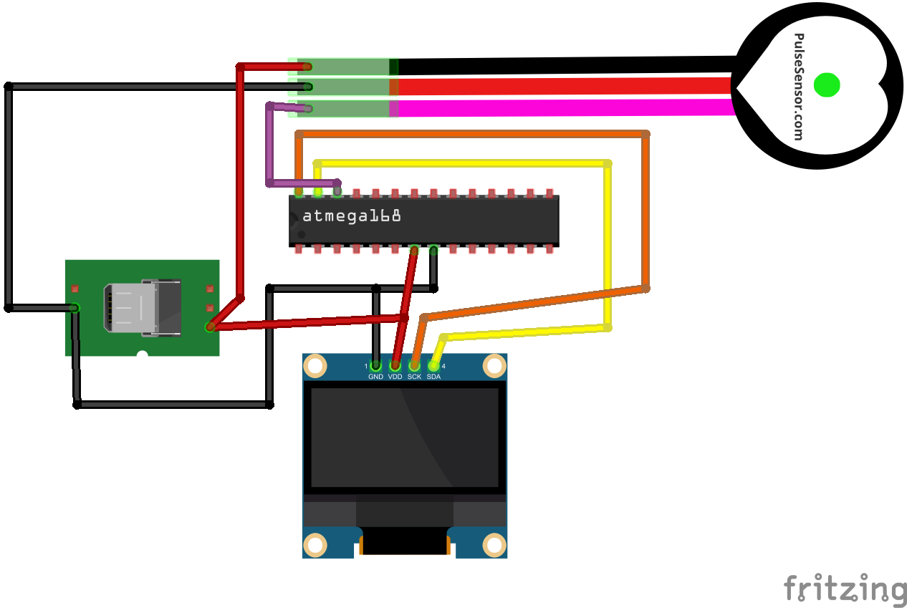
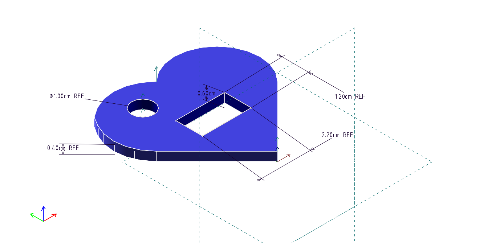

# Description
Project to display your heartbeat. Done with oled display and pulsesensor.

# Team
* Member 1 - role
* Member 2 - role

# Images

(link to youtube if you have)[https://youtube.com]
(link to thingiverse if you have)[https://thingiverse.com]

# Part List

Label |	Part Type |	Properties
---|---|---
OLED I2C1	|	OLED 128x64 I2C Monochrome Display |	variant variant 2
SENSOR |	Pulse Sensor |	variant variant 1; package SIP
U1	|	atmega168	type ATMEGA168; | variant dip28 THT; version Atmega168-20PU; package dip
USB |	USB_MICROB_PLUG |	variant -pth; package micro-b-ra-th; target Micro-B

See markdown tables for details